<div align="center">
  <h2>Flutter Demo</h2>
</div>

Codice dell'applicazione di esempio realizzata durante la parte di demo per mostrare le caratteristiche di Flutter.

Per configurare correttamente l'applicazione si deve creare un file chiamato `.env` nella root del progetto in `code/flutter_jac` con questo contenuto:

```bash
NEWS_API_URL="https://newsapi.org/v2"
NEWS_API_KEY=<newsapi_org_api_key>
PEXELS_API_URL="https://api.pexels.com/v1"
PEXELS_API_KEY=<pexels_org_api_key>
POKEMON_API_URL="https://pokeapi.co/api/v2"
```

#### Assets

Nella cartella [assets/json/](assets/json/) sono stati salvati dei json di esempio da utilizzare come base di partenza per la creazione di layout nell'applicazione.

## 📱 Screenshots

| Home                                    | Lista (1)                                  | Single Page                                       |
| --------------------------------------- | ------------------------------------------ | ------------------------------------------------- |
| 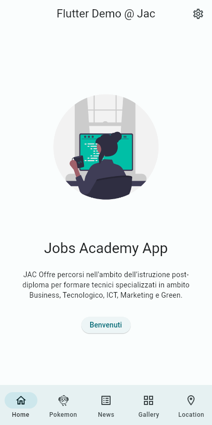 | 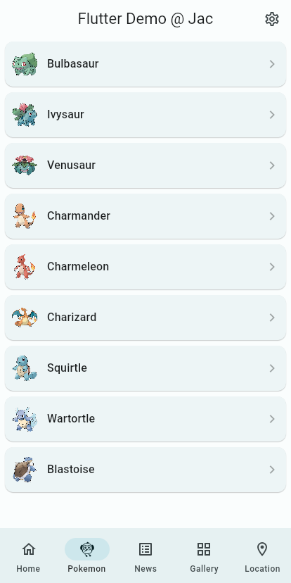 | 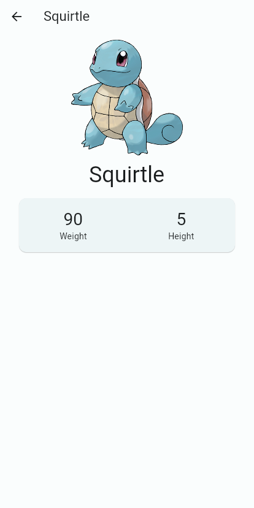 |
| 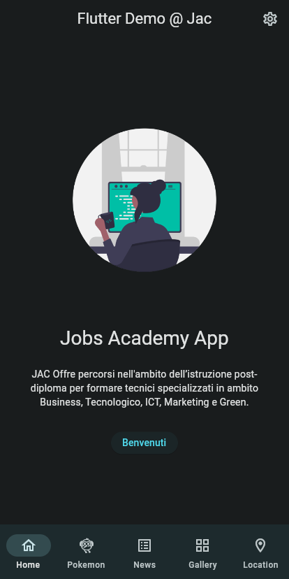  | 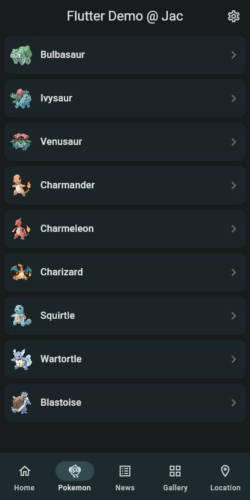  | 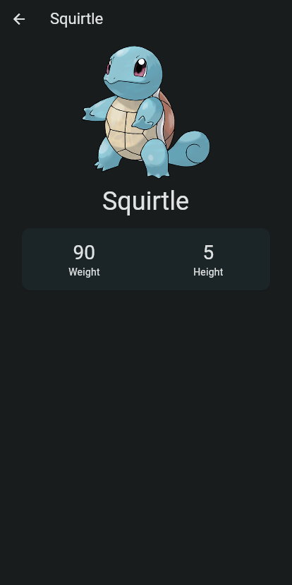  |

| Lista (2)                                  | Griglia                                    | Ip Location                                    |
| ------------------------------------------ | ------------------------------------------ | ---------------------------------------------- |
| 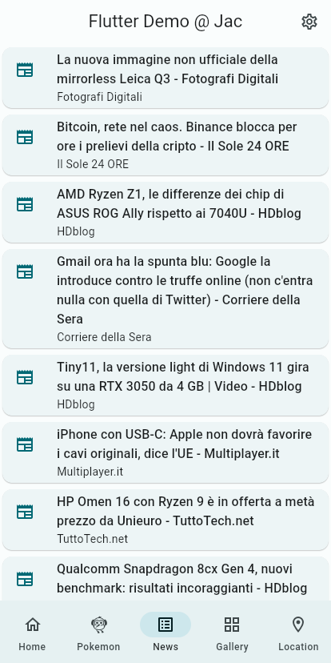 | 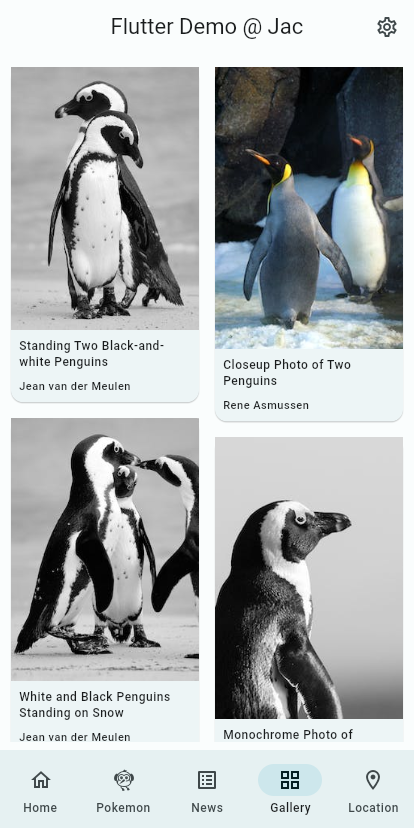 | 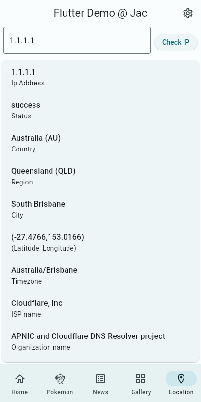 |
| 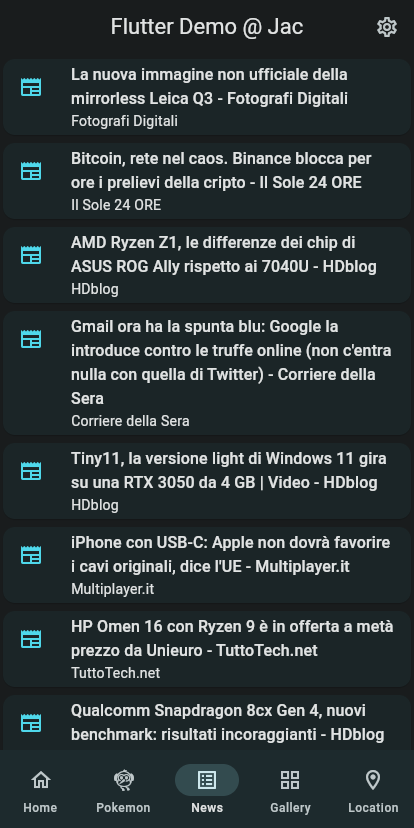  | 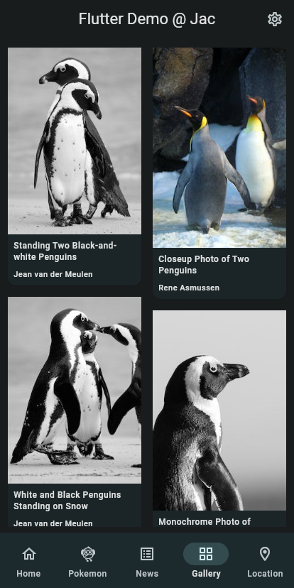  | 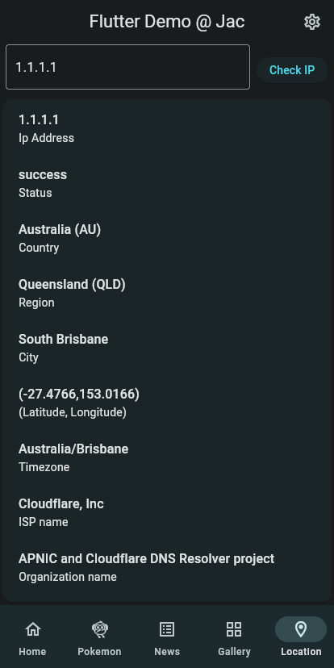  |

## 🐝 API

* [Free for Developers](https://free-for.dev/#/?id=apis-data-and-ml): elenco di software (SaaS, PaaS, IaaS, ecc.) e altre offerte che hanno livelli gratuiti per gli sviluppatori
* [News API](https://newsapi.org/): ricerca di notizie sul web con il codice, ottenendo risultati JSON. Gli sviluppatori hanno a disposizione 3.000 query gratuite al mese.
* [Pexels API](https://www.pexels.com/api/): offrite ai vostri utenti l'accesso alla nostra intera libreria di foto e video senza lasciare la vostra app o il vostro sito web. È gratuita e si integra perfettamente con poche righe di codice. Iniziate e riceverete immediatamente la vostra chiave API unica.
* [PokéAPI - The RESTful Pokémon API](https://pokeapi.co/): Tutti i dati sui Pokémon di cui avete bisogno in un unico posto, facilmente accessibile attraverso una moderna API RESTful.
* [IP Geolocation API](https://ip-api.com/)

## 💎 Contributing

Se hai qualche idea, sentiti libero di inviarmi le tue modifiche nella sezione delle [issue](https://github.com/polilluminato/presentazione-flutter-jac-2023/issues) o con una pull request.

## 📋 License

```
Copyright 2023 Alberto Bonacina

Licensed under the Apache License, Version 2.0 (the "License");
you may not use this file except in compliance with the License.
You may obtain a copy of the License at

   http://www.apache.org/licenses/LICENSE-2.0

Unless required by applicable law or agreed to in writing, software
distributed under the License is distributed on an "AS IS" BASIS,
WITHOUT WARRANTIES OR CONDITIONS OF ANY KIND, either express or implied.
See the License for the specific language governing permissions and
limitations under the License.
```